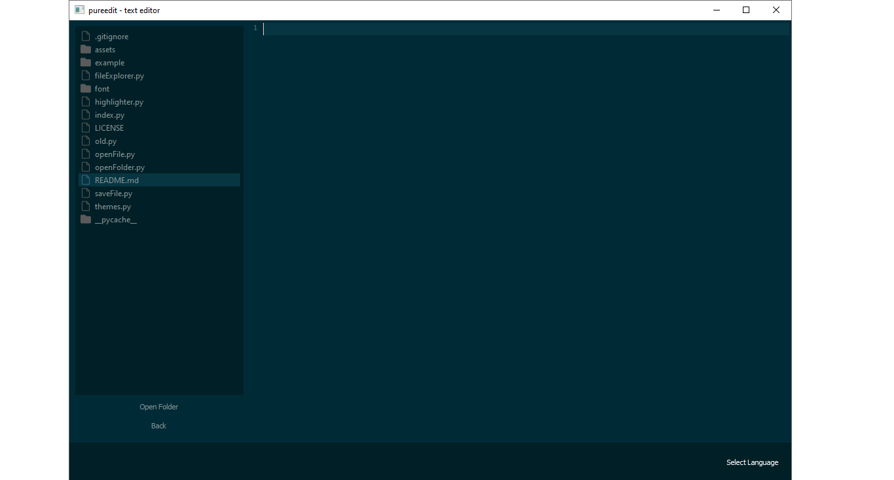

# LiteCode

## Description

**LiteCode** is an innovative text editor designed to be more elegant, faster, and better at coding. With a minimalist interface and advanced functionalities, LiteCode provides a distraction-free coding experience, allowing developers to focus on what really matters: writing quality code.

## Features

- **Elegant Interface**: A clean and modern design that enhances the visual and user experience.
- **Fast Performance**: Optimized for quick load times and responsive behavior, even with large projects.
- **Multi-language Support**: Compatible with multiple programming languages such as Python, JavaScript, C++, and more.
- **Smart Autocomplete**: Autocomplete functionality that suggests relevant code snippets to speed up writing.
- **Customizable Themes**: Multiple color themes available, with the option to create and share your own themes.
- **Extensions and Plugins**: Extensive support for extensions that allow you to add new functionalities as needed.
- **Integrated Preview**: Real-time code preview for HTML, Markdown, and other markup languages.
- **Project Management**: Integrated tools for efficient project organization and management.

## Screenshots

Pero crea otro ## Con las contribuciones de que pueden contribuir si hacen issues
¡Entendido! Aquí tienes el README.mdactualizado con una nueva sección específica sobre cómo contribuir a través de issues:

markdown
# LiteCode

## Description

**LiteCode** is an innovative text editor designed to be more elegant, faster, and better at coding. With a minimalist interface and advanced functionalities, LiteCode provides a distraction-free coding experience, allowing developers to focus on what really matters: writing quality code.

## Features

- **Elegant Interface**: A clean and modern design that enhances the visual and user experience.
- **Fast Performance**: Optimized for quick load times and responsive behavior, even with large projects.
- **Multi-language Support**: Compatible with multiple programming languages such as Python, JavaScript, C++, and more.
- **Smart Autocomplete**: Autocomplete functionality that suggests relevant code snippets to speed up writing.
- **Customizable Themes**: Multiple color themes available, with the option to create and share your own themes.
- **Extensions and Plugins**: Extensive support for extensions that allow you to add new functionalities as needed.
- **Integrated Preview**: Real-time code preview for HTML, Markdown, and other markup languages.
- **Project Management**: Integrated tools for efficient project organization and management.

## Contributions

Contributions are welcome! If you want to collaborate on **LiteCode**, follow these steps:
``bash
git checkout -b branch-name
``
``bash
git commit -m "this is a commit"
``
``bash
git push origin branch-name
``

Finally, create a pull request on GitHub and describe your changes in detail.

## Open Contributions

We warmly invite contributions from anyone interested in making LiteCode better. Whether you're a seasoned developer or just starting out, your input is valuable. Feel free to:

- Suggest new features.
- Report bugs and issues.
- Improve documentation.
- Create new themes or plugins.
- Share feedback and ideas.

To start contributing, simply fork the repository and follow the usual steps mentioned above. We appreciate all forms of contribution and look forward to your collaboration!

## License

This project is licensed under the Creative Commons Attribution-NonCommercial-ShareAlike 4.0 International License.

